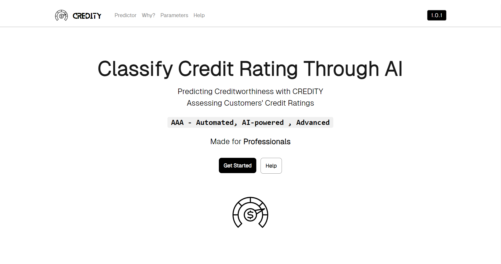
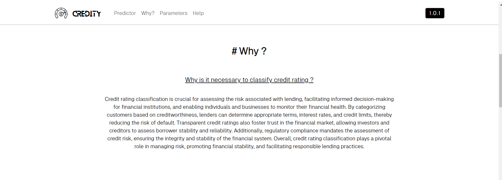
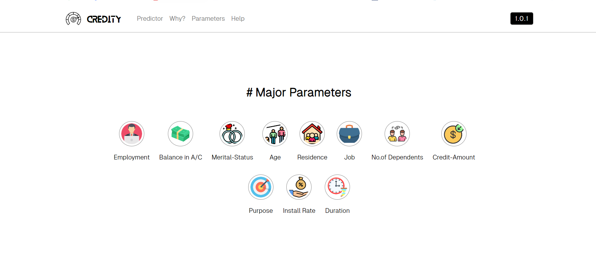
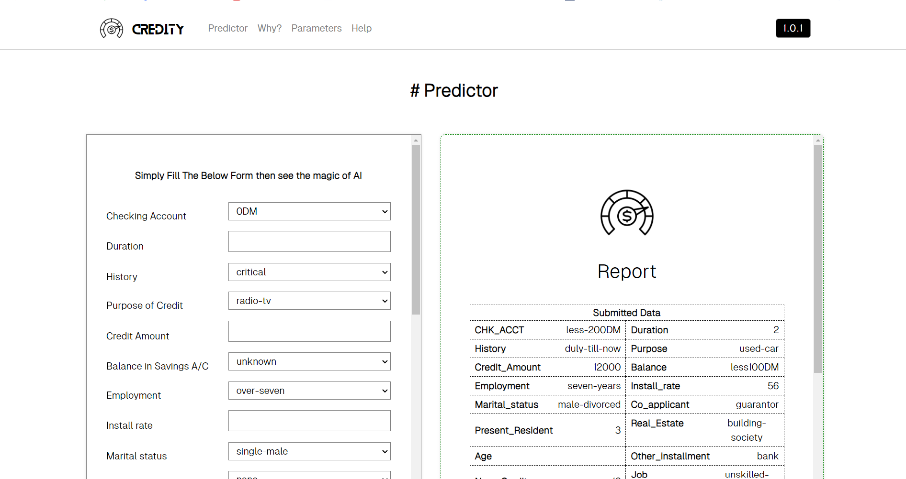
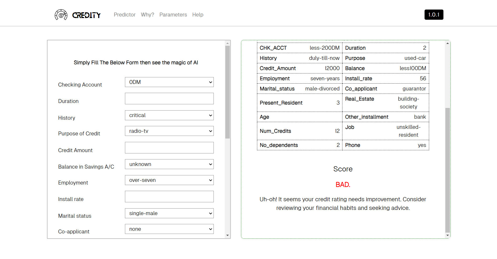
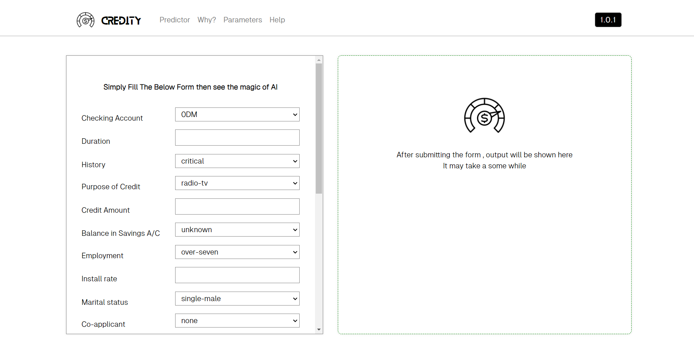
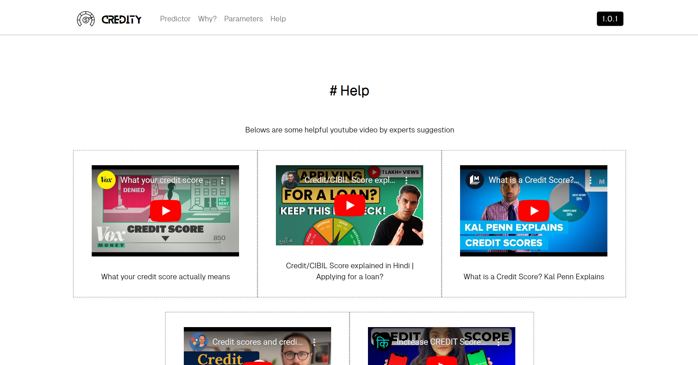

# #Welcome to CREDITY

- Classify the customer's credit rating (good or bad) based on their personal and bank
account details

<!--  -->

## #How to Run

To run the Flask app locally, follow these steps:

1. Install virtualenv:
    ```bash
    pip install virtualenv
    ```

2. Create a Python virtual environment:
    ```bash
    virtualenv venv
    ```

3. Activate the virtual environment:
    - Windows:
        ```bash
        venv\Scripts\activate
        ```
    - Linux:
        ```bash
        source ./venv/bin/activate
        ```

4. Install the required dependencies using pip:
    ```bash
    pip install -r requirements.txt
    ```

5. Start the Flask app:
    ```bash
    python app.py
    ```

6. Open your web browser and go to `http://localhost:5000` to view the website.


## Model Training

The `train_model.py` file contains the code for training the machine learning model used in the application.
We have used the RandomForest algorithm for classification

## Referencing Documentation

You can refer to the `documentation.docx` file located in the project directory for additional documentation and information.

# #Website Screenshots


*MAIN SECTION*


*WHY SECTION*


*PARAMETERS SECTION*


*PREDICTOR SECTION*


*PREDICTOR SECTION*


*PREDICTOR SECTION*


*HELP SECTION*

## Contributors

- Shubham Sinha (https://www.linkedin.com/in/shubhamsinhaaa/)
- Anurag Sinha (https://www.linkedin.com/in/anuragsinha03/)
- Darshan Balar (https://www.linkedin.com/in/darshan-balar-4302141bb/)

## Additional Notes
- Ensure that you have Python and pip installed on your machine.
- Customize the Flask app according to your specific requirements.

## License
This project is licensed under the [MIT License](LICENSE).


